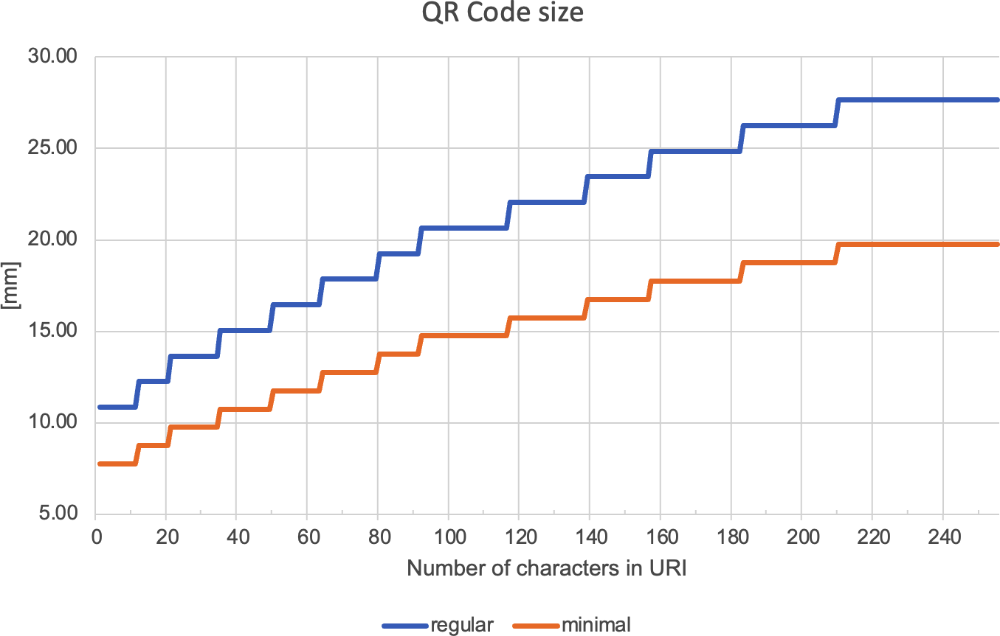

<!-- Back to top link -->

# IEC 61406-1 QR Codes Size Comparison (default error correction level Q)

| Length of <uri> (character counts) | QR Code size (in pixels) | QR Code size (in mm) | min. QR Code size (in mm)
|-|-|-|-|
| 1 up to 11 | 310 x 310  | 10.85  | 7.75 |
| 12 up to 20 | 350 x 350  | 12.25  | 8.75 |
| 21 up to 34 | 390 x 390 | 13.65 | 9.75 |
| 35 up to 49 | 430 x 430 | 15.05 | 10.75 |
| 50 up to 63 | 470 x 470 | 16.45 | 11.75 |
| 64 up to 79 (incl. **72**) | 510 x 510 | 17.85 | 12.75 |
| 80 up to 91 | 550 x 550 | 19.25 | 13.75 |
| 92 up to 116 | 590 x 590 | 20.65 | 14.75 |
| 117 up to 138 | 630 x 630 | 22.05 | 15.75 |
| 139 up to 156 | 670 x 670 | 23.45 | 16.75 |
| 157 up tp 182 | 710 x 710 | 24.84 | 17.75 |
| 183 up to 209 | 750 x 750 | 26.25 | 18.75 |
| 210 up to 249 | 790 x 790 | 27.65 | 19.75 |
| 250 up to **255** | 830 x 830 | 29.05 | 20.75 |

*Note: IEC 61406-1 requirement ILS-5 regarding String length: Max.* ***72*** *or* ***255*** *characters*

(<a href="#readme-top">back to top</a>)
